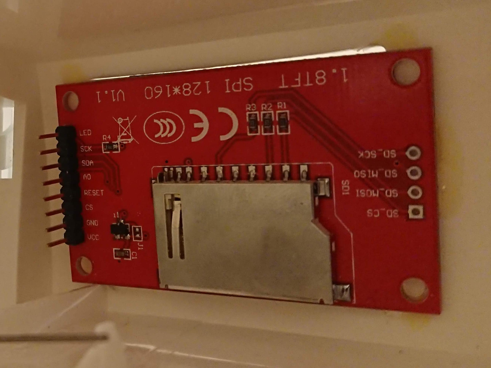

# 1.8" ST7735R TFT LCD Display
There seems to be quite a lot of different displays using this chip, all with a little different break out boards.
The driver is included in the official Linux kernel since a while a go, which makes them really easy to use, as soon as you got it connected.

Mine had the following pins, and this is how I connected it:  
| Display | GPIO | Pin# |
|---------|------|------|
|   Led   | 9    | 21   |
|   SCK   | 11   | 23   |
|   SDA   | 10   | 19   |
|   A0    | 24   | 18   |
|   Reset | 25   | 22   |
|   CS    | 8    | 24   |
|   GND   |      | GND  |
|   VCC   |      | 3.3v |



The LED pin is only used control the backlight, not to power it. This makes it possible to dim the brightness with PWM from a GPIO pin.
To enable the backlight all the time, just connect it to a 3.3v pin.

# Debug
The display is not in use yet. But you can try it by first loading the kernel module:  
`sudo modprobe fbtft_device name=adafruit18 rotate=270`  

Then you can display an image, using `fbi`:  
```bash
fbi -a -v -T 1 -d /dev/fb1 -nocomments image.jpg
```
